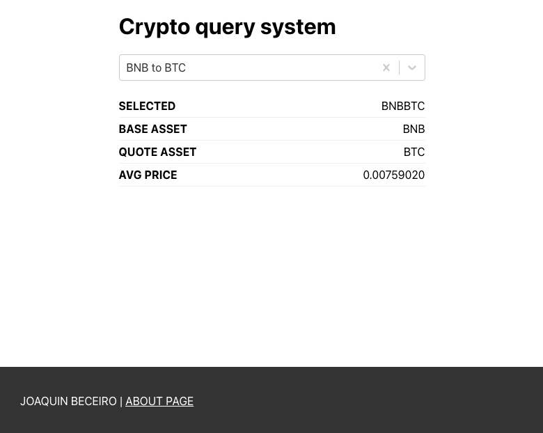

<h1 align="center">Getting Started with React</h1>

 

## About this project

In this project, I'm trying to show several react functionalities such as state management, context, API calls, conditional rendering among others.

This application interacts with Binance public APIs to extract price information from cryptocurrency conversions.

## Libraries

- Styled components - [GitHub](https://github.com/styled-components/styled-components)
- Axios - [GitHub](https://github.com/axios/axios)
- React Router DOM - [GitHub](https://github.com/remix-run/react-router)
- React Select - [GitHub](https://github.com/jedwatson/react-select)

## What could you learn with this project?

- How to build the structure of a project
- Using conditional rendering
- Basic use of React Router and Links
- Basic use of Styled Components
- Basic use of react hooks
- Use Context with a simple and scalable structure
- Make calls to APIs with Axios and save the data in different types of states
- Integrate a third-party component like React Select

## Start project

1. Clone this project

`git clone https://github.com/JoaquinBeceiro/react-beginner.git`

2. Install dependencies

`npm install`

3. Start project!

`npm start`

## Author

**Joaquin Beceiro**

- [GitHub](https://github.com/JoaquinBeceiro)
- [Web](https://JoaquinBeceiro.com.uy)
